# Glorius Lab — ML & Data Science Subgroup Website

Website for the **Data Science Subgroup** of the [Glorius Lab](https://www.uni-muenster.de/Chemie.oc/glorius/) at the Organisch-Chemisches Institut, University of Munster. The group focuses on machine learning, data-driven approaches, and computational methods applied to organic chemistry.

<!--  -->
<p align="center">
  
</p>


## Tech Stack

| Layer | Technology |
|---|---|
| Runtime / bundler / package manager | [Bun](https://bun.sh) |
| Frontend | React 19 + TypeScript |
| Server | `Bun.serve()` (no Express) |
| Styling | Plain CSS with custom properties |
| Analytics | PostHog (GDPR-compliant, opt-out by default) |

## Getting Started

### Prerequisites

Install [Bun](https://bun.sh):

```bash
curl -fsSL https://bun.sh/install | bash
```

### Install Dependencies

```bash
bun install
```

### Environment Variables

Create a `.env` file in the project root:

```env
VITE_PUBLIC_POSTHOG_KEY=          # PostHog project API key (leave empty to disable)
VITE_PUBLIC_POSTHOG_HOST=https://eu.i.posthog.com
VITE_PUBLIC_POSTHOG_ENABLED=false # Enable/disable analytics
DEV_THEME_SWITCH=true             # Show accent color dev switcher in navbar
```

Bun auto-loads `.env` — no dotenv needed.

### Development

```bash
bun dev
```

Starts the server with hot module reloading at `http://localhost:3000`.

### Production

```bash
bun start
```

Runs with `NODE_ENV=production`.

## Project Structure

```
src/
├── index.ts                  # Bun.serve() entry — routes & API endpoints
├── data/
│   ├── members.json          # Team member profiles
│   ├── projects.json         # Open-source project listings
│   ├── publications.json     # Academic publications
│   └── research.json         # Research theme descriptions
└── design5/                  # Active frontend
    ├── index.html            # HTML entry point
    ├── app.tsx               # App root (PostHog, theming, layout)
    ├── styles.css            # All styles (CSS custom properties)
    ├── components/
    │   ├── Hero.tsx           # Landing section
    │   ├── Nav.tsx            # Navigation bar + theme toggles
    │   ├── Projects.tsx       # Project card grid
    │   ├── Publications.tsx   # Publication list
    │   ├── Team.tsx           # Team member cards
    │   ├── Contact.tsx        # Address & email
    │   ├── Footer.tsx         # Footer with legal links
    │   ├── CookieBanner.tsx   # GDPR cookie consent
    │   ├── MoleculeCanvas.tsx # Animated molecule background
    │   └── ParallaxMoleculeCanvas.tsx  # Parallax variant (active)
    └── shared/
        ├── accents.ts         # Accent color presets (Cyan, Yellow, Red, Pale, Green)
        ├── hooks.ts           # useScrollReveal (IntersectionObserver)
        ├── icons.tsx          # SVG icon components
        ├── types.ts           # TypeScript interfaces
        └── utils.ts           # Avatar gradients & initials helpers
```

## API Routes

| Route | Method | Description |
|---|---|---|
| `/` | GET | Serves the React SPA (`design5/index.html`) |
| `/api/posthog-config` | GET | Returns PostHog configuration from env vars |
| `/api/dev-config` | GET | Returns `{ themeSwitch }` flag for the dev accent switcher |

## Content

All content is driven by JSON files in `src/data/` — update team members, projects, and publications without touching React code.

- **`members.json`** — Team profiles (name, role, image, email, links)
- **`projects.json`** — GitHub repositories from [GloriusGroup](https://github.com/GloriusGroup) (name, description, language, tags, URL)
- **`publications.json`** — Papers with authors, journal, year, DOI, and tags
- **`research.json`** — Research theme descriptions

## Features

- Dark / light mode toggle (dark default)
- 5 accent color presets switchable via DEV button (when `DEV_THEME_SWITCH=true`)
- Animated parallax molecule canvas background
- Scroll-reveal animations
- Responsive mobile navigation
- Skip-to-content link (WCAG 2.4.1)
- Cookie consent banner (only when PostHog is enabled)
- `prefers-reduced-motion` support

## Analytics

PostHog analytics are **disabled by default**. When enabled:

- Opt-out by default — no data sent until explicit cookie consent
- Honors browser Do Not Track
- No full IP logging, no session recording, no heatmaps, no autocapture
- Only page views and page leave events are tracked
- Compliant with University of Munster Datenschutz policy
